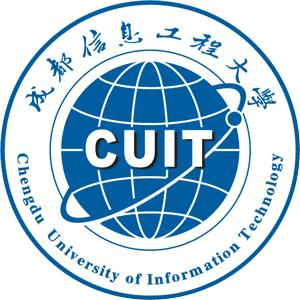

# 电信校园网提速

# universityTelecom

## 原理

#### 同一路由器插入多根网线认证多个账户,实现合理分配带宽,从而进行宽带叠加

## 开始上手

#### 1.根据"路由器固件"文件夹里的教学将您的路由器刷至可以设置虚拟wan口的状态,推荐斐讯K2P刷入高格固件,拼多多160大洋,也不贵

#### 2.下载"虚拟网口认证"文件夹里的所有文件(一定要所有)并将其储存在英文路径下,根据"readme.txt"进行配置

#### 3.根据"多线设置"文件夹内教程设置路由器的负载均衡,实现带宽叠加

#### 4.享受高速网络吧,有问题请issue

------

版权及最终解释权所有人:成都信息工程大学的fever_king

SYCNB!

All Rights reserve © fever_king, CUIT

