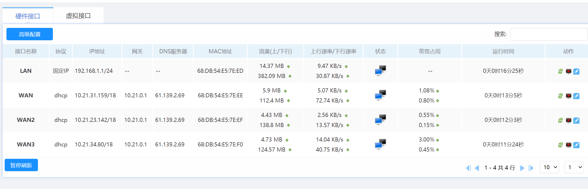

## 路由器配置

#### 1.打开高格固件后台,http://192.168.1.1,默认用户名密码都为admin(之后每一步都要保存,不再赘述)

#### 2.选择"高级设置->弹性端口"根据你的情况添加wan口

#### 3.选择"网络设置->外网配置",将所有wan口改为自动获取IP,网络类型及带宽根据实际填写

#### 4.完成之后在"网络设置->接口概览"中获取所有wan口的IP,记录

#### 5.在确保能连接验证服务器的情况下打开"CUIThacker.exe",根据虚拟网口认证文件夹提示进行认证

#### 6."设置向导->专家向导"进行设置,内网主机根据实际填写,最后应用

#### 7.进入"QOS->智能QOS",取消所有勾选,保存

#### 8.完成后,应如图所示:

